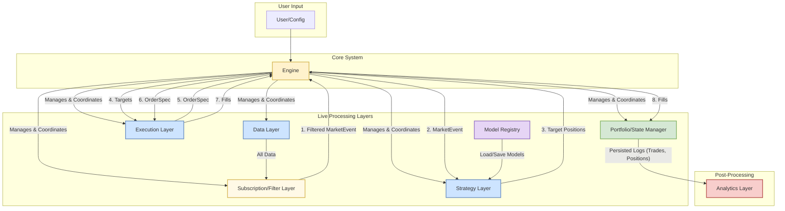

# Simulor: System Architecture

This document outlines the high-level architecture of the Simulor backtesting framework, integrating the Data, Strategy, Execution, and Analytics modules into a cohesive, powerful, and extensible system.

> 📖 **Terminology Reference**: For standardized terminology used throughout the documentation, see the [Glossary](glossary.md).

## 1. Design Philosophy & Core Principles

The architecture is built on a set of core principles that ensure the framework is robust, flexible, and suitable for both rapid prototyping and institutional-grade quantitative research.

- **Separation of Concerns**: Each module (Data, Strategy, Execution, Analytics) has a distinct responsibility and operates independently. This modularity allows components to be developed, tested, and replaced without impacting the rest of the system. For example, the strategy logic is completely decoupled from the execution model, allowing the same strategy to be tested with simple fills or a complex L2 order book simulator.

- **Event-Driven Core**: The system is orchestrated by an event-driven engine. Market data flows through the system, triggering the strategy pipeline: AlphaModel generates signals, PortfolioConstructionModel calculates targets, RiskModel applies constraints, and ExecutionModel generates orders. This clean data flow design is highly testable and mirrors real-world trading systems.

- **Pluggability & Extensibility**: Every key component is designed as a "plugin." Users compose strategies from pluggable AlphaModel, PortfolioConstructionModel, RiskModel, and ExecutionModel components. The framework provides robust built-in implementations but allows for deep customization through custom model implementations.

- **Environment Parity (Backtest vs. Live)**: The framework is designed to provide a seamless transition from historical backtesting to paper trading and live execution. Strategy code is 100% environment-agnostic. The same strategy logic that runs in a backtest can be deployed to a live broker connection without modification, ensuring that validated results translate to the real world.

- **Data-Centric & Immutable**: The system treats data as a first-class citizen. Events and data objects are generally treated as immutable, preventing unintended side effects and making state management predictable. All historical analysis is based on point-in-time data to prevent look-ahead bias.

- **Reproducibility by Design**: Every backtest and analysis run is fully reproducible. The system versions and stores all inputs: configuration, data sources, random seeds, and code versions. This guarantees that any result can be perfectly replicated for auditing, debugging, or peer review.

---

## 2. High-Level Architecture

The system consists of a central **Engine** that coordinates the flow of events between the primary layers: Data, Strategy, Execution, and Portfolio Management. The Analytics module operates post-run on the persisted output.

---

## 3. Component Breakdown

### 3.1. Engine

The central orchestrator of the framework.

- **Responsibilities**:
  - **Configuration Loading**: Initializes the system based on Strategy objects (specifying alpha, portfolio, risk, execution models, etc.).
  - **Event Loop Management**: Runs the main event loop, which drives the simulation. In a backtest, this involves chronologically processing historical data. In live trading, it processes real-time events.
  - **Subscription Management**: Coordinates data subscriptions from strategies and configures the Subscription/Filter Layer to deliver only requested data.
  - **Pipeline Coordination**: On each MarketEvent, orchestrates the strategy pipeline flow: MarketEvent → AlphaModel → PortfolioConstructionModel → RiskModel → ExecutionModel → Target Positions → OrderSpec.
  - **State Management**: Coordinates the overall state of the system, including the current simulation time, positions, and capital.
  - **Lifecycle Management**: Manages the lifecycle of all strategy components, calling `initialize()` and `shutdown()` methods as appropriate.

### 3.2. Data Layer

Responsible for sourcing, processing, and serving all market, fundamental, and alternative data.

- **Components**:
  - **Data Sources**: Pluggable connectors to various data providers (flat files like CSV/Parquet, databases, cloud storage, live vendor APIs).
  - **Data Feeder / Event Generator**: Reads data from the sources and generates point-in-time `MarketEvent` objects which carry `MarketData` payloads. It is responsible for handling time progression, respecting market hours, and managing corporate actions.
  - **Subscription/Filter Layer**: Filters incoming data based on strategy subscriptions (symbols, resolutions, data types). Only delivers subscribed data to strategies, dramatically reducing memory usage for large universes (1000+ symbols).
  - **Data Cache**: An optional layer for caching frequently accessed data in memory or on disk to accelerate subsequent runs.

### 3.3. Strategy Layer

The "brain" of the trading system, composed of pluggable components.

-- **Components**:
    - **Strategy**: Configuration object that defines the capital allocation and pluggable components (universe, alpha, portfolio, risk, execution models). Strategies express **what they want to hold** via target positions; they never emit orders directly.
    - **UniverseSelectionModel**: Determines which symbols to trade at each point in time (static lists, dynamic filters, or custom logic).
    - **AlphaModel**: Receives MarketEvent and generates trading signals (BUY/SELL/HOLD) for symbols in the active universe.
    - **PortfolioConstructionModel**: Converts signals into target positions based on portfolio construction logic (equal weight, risk parity, etc.).
    - **RiskModel**: Applies risk constraints to target positions (position limits, stop losses, leverage constraints).
    - **ExecutionModel**: Converts target positions into OrderSpec to achieve desired portfolio state (immediate market orders, VWAP, TWAP, etc.).

**Key Design**: Strategies emit **target positions** (desired portfolio state), not direct orders. The ExecutionModel is the only component that translates targets into OrderSpec, allowing the same strategy to use different execution approaches without any strategy code changes.

### 3.4. Execution Layer

Responsible for translating OrderSpec into simulated or real fills.

- **Components**:
  - **Order Manager**: Receives OrderSpec from ExecutionModel, validates them, and manages the entire lifecycle of an order (pending, working, filled, cancelled).
  - **Fill Model**: A pluggable component that determines how and when an OrderSpec is filled. Implementations range from simple (instant fill at mid-price) to highly realistic (L2 order book matching). This is the core of the backtest simulation.
  - **Cost Model**: Applies all transaction costs, including commissions, fees, slippage, and market impact.
  - **Latency Model**: Simulates delays in order transmission and execution.
  - **Broker Gateway (Live Trading)**: In a live environment, this component replaces the Fill Model and translates OrderSpec into API calls to a real brokerage.

### 3.5. Portfolio & State Manager

The single source of truth for the strategy's state, including positions, cash, and P&L.

- **Responsibilities**:
  - **Position Tracking**: Subscribes to `FillEvent` objects from the Execution Layer. Upon receiving a fill, it updates the portfolio's positions.
  - **Cash Management**: Adjusts cash balances based on trades, fees, dividends, and financing costs.
  - **Mark-to-Market P&L**: Calculates unrealized and realized P&L based on current market prices.
  - **State Provider**: Provides the strategy with a read-only view of its current positions and buying power, which it can use in its decision-making logic.
  - **Persistence**: Logs all transactions and position changes, which serve as the primary input for the Analytics Layer.

### 3.6. Model Registry

Manages machine learning models and their lifecycle for ML-driven strategies.

- **Responsibilities**:
  - **Model Storage**: Persists trained models to disk with versioning and metadata.
  - **Model Loading**: Loads pre-trained models for use in backtesting or live trading.
  - **Version Management**: Tracks model versions, training dates, and performance metrics.
  - **Model Metadata**: Stores feature definitions, hyperparameters, and training configurations.
  - **Reproducibility**: Ensures exact model versions can be loaded for backtest reproduction.

**Design Decision**: The Model Registry is separate from the strategy layer, enabling model reuse across strategies and maintaining a clear separation between model training (offline) and model inference (online during trading).

**Integration**: Strategies access the Model Registry during initialization to load required models. The registry handles serialization/deserialization for multiple ML frameworks (scikit-learn, XGBoost, LightGBM, PyTorch, TensorFlow).

### 3.7. Analytics Layer

A post-processing module that operates on the persisted logs from a completed run.

- **Responsibilities**:
  - **Data Ingestion**: Reads trade logs, position histories, and signal logs generated by the other layers.
  - **Metrics Computation**: Calculates all performance, risk, and execution quality metrics.
  - **Attribution & Diagnostics**: Decomposes performance and identifies sources of alpha or error.
  - **Visualization & Reporting**: Generates interactive dashboards, charts, and static reports.
  - **Independence**: Because it runs after the simulation is complete, complex analysis does not slow down the backtest itself.

---

## 4. Event & Data Flow: The Backtest Loop

A typical event loop for a single time step in a backtest proceeds as follows:

1. **Time Tick**: The **Engine** advances the simulation clock to the next timestamp `T`.
2. **Data Event**: The **Data Provider** generates all available market data for time `T`.
3. **Subscription Filtering**: The **Subscription/Filter Layer** filters data based on active strategy subscriptions, delivering only requested symbols and resolutions.
4. **MarketEvent Delivery**: The **Engine** receives filtered `MarketEvent` objects and routes them to subscribed strategies.
5. **Universe Selection**: For each Strategy, the **Engine** calls `UniverseSelectionModel.select_universe()` to get the current trading universe (typically cached and updated on rebalance schedule).
6. **Alpha Signal Generation**: The **Engine** calls `AlphaModel.generate_signals(event, universe)` to get trading signals for symbols in the universe.
7. **Portfolio Construction**: The **Engine** calls `PortfolioConstructionModel.calculate_targets(signals, capital)` to convert signals into target positions.
8. **Risk Management**: The **Engine** calls `RiskModel.apply_limits(targets, current_positions)` to apply risk constraints.
9. **Order Generation**: The **Engine** calls `ExecutionModel.generate_orders(targets, current_positions)` to create OrderSpec.
10. **Order Execution**: The **Execution Layer's Order Manager** receives OrderSpec and validates them.
11. **Fill Simulation**: The **Fill Model** evaluates OrderSpec against the current market data.
    - If the OrderSpec fills (or partially fills), the Fill Model generates a fill event containing the execution price and quantity.
    - The **Cost Model** attaches transaction costs to the fill.
12. **Portfolio Update**: The **Portfolio Manager** updates positions, adjusts cash balance, and logs the transaction.
13. **Loop Continues**: The Engine advances the clock to the next event, and the cycle repeats.
14. **Backtest End**: Once all historical data is processed, the Engine shuts down all components.
15. **Post-Processing**: The user can now run the **Analytics Layer** on the logs generated by the Portfolio Manager and Execution Layer to analyze the performance of the completed run.

---

## 5. Cross-Cutting Concerns

- **Configuration**: A unified configuration system (e.g., using YAML or Python objects) allows the user to define the entire backtest setup in a single place, specifying which plugins to use for each layer and their parameters.
- **Logging**: A structured logging framework captures events, warnings, and errors from all components, tagged with the simulation timestamp and component name for easy debugging.
- **Persistence**: The framework defines standard formats for all output logs (trades, positions, orders) to ensure they can be consumed reliably by the Analytics Layer and other external tools.

---

## 6. Environment Parity: Backtest vs. Live

The architecture is designed to make the transition from backtest to live trading seamless.

- **In Backtest Mode**:
  - The `Data Provider` reads from historical data files.
  - The `Engine`'s event loop is driven by historical timestamps.
  - The `Execution Layer` uses a `Fill Model` to simulate fills.

- **In Live Trading Mode**:
  - The `Data Provider` connects to a live market data WebSocket/API.
  - The `Engine`'s event loop is driven by real-time events.
  - The `Execution Layer` replaces the `Fill Model` with a `Broker Gateway` plugin, which translates orders into real API calls to a brokerage.
  - Fill events are generated based on actual fill confirmations received from the broker.

Crucially, the **Strategy components** (AlphaModel, PortfolioConstructionModel, RiskModel, ExecutionModel) and **Portfolio Manager** are completely unaware of this switch. They continue to operate on the same data types (`MarketData`, fills), ensuring the core logic remains identical and validated.
